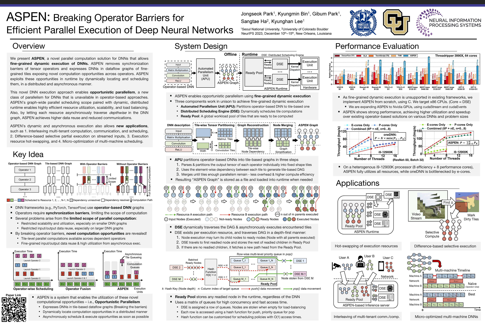

## NeurIPS'23 release of ASPEN: Breaking Operator Barriers for Efficient Parallelization of Deep Neural Networks

This is the proof-of-concept CPU implementation of ASPEN used for the NeurIPS'23 paper **"ASPEN: Breaking Operator Barriers for Efficient Parallelization of Deep Neural Networks"**.  [[OpenReview Link](https://openreview.net/forum?id=eTp4RetK74)] 

Below is a poster description of our work. You can find a more detailed presentation slide deck and the full paper in the following link. [[NeurIPS 2023 Link](https://neurips.cc/virtual/2023/poster/70957)]

---

In this repository, we included three simple usage examples of the ASPEN system, which were provided in the supplementary material of the NeurIPS'23 submission.

The "src" directory includes the source code of ASPEN. 

The "include" directory includes the header files of ASPEN. 

The "files" directory includes the miscellaneous files for the examples.

The "examples" directory includes three examples of ASPEN as follows:

1. Executing ResNet-50 Inference using ASPEN.
2. Executing batched muti-DNN co-inference of ResNet-50 and VGG-16 using ASPEN.
3. Migrating and executing a custom DNN from PyTorch to ASPEN.

The detailed instruction for each example is provided in the "instructions.txt" file in each example directory.

Run "make" to compile the libaspen.a library. The examples are built separately, as described in the instruction.txt files.

The Makefile is configured to compile the ASPEN library with an AVX2 backend.

Weights, pre-generated ASPEN graphs, and other files used in our paper are stored in [this Google Drive](https://drive.google.com/drive/folders/1pH19a9sadbV10_RxHcKnWIqvgX4zQpmh?usp=sharing). 

ASPEN has a dependency on OpenMP. The examples of this supplementary material have dependencies on PyTorch, TorchVision, and GCC.

Please contatct cakeng at snu dot ac dot kr if you have any questions!
